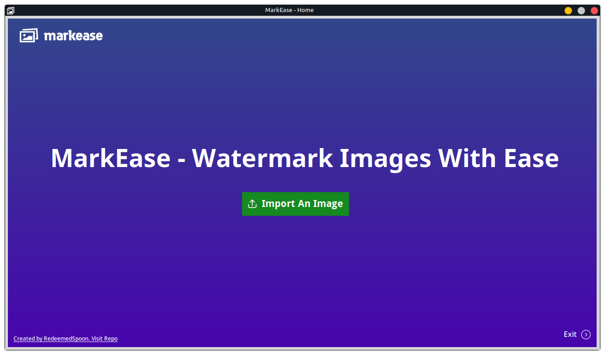

# MarkEase - Minimal Yet versatile


## Introduction

MarkEase is a sophisticated yet user-friendly Python application tailored for watermarking images. Designed with simplicity and efficiency in mind, this tool offers a comprehensive suite of features to enhance your images with text, shapes, and other customizable elements. Whether you're a professional photographer, graphic designer, or just someone looking to personalize your images, MarkEase is the go-to solution that simplifies the watermarking process. Very simple Solution to replace Photoshop or Gimp. No learning curve, MarkEase has everything you need to get started.

## Features

### 1. Import Images

-  **Versatile Format Support**: MarkEase allows users to effortlessly import images in various formats, including JPEG, PNG, and GIF, ensuring compatibility with most image files you work with.
-  **User-Friendly Interface**: The import feature is seamlessly integrated into the application's intuitive user interface, enabling quick and hassle-free image uploads.

### 2. Text Watermarking

-  **Customizable Text Elements**: MarkEase empowers users to add custom text to their images, providing options to select from a range of font sizes, styles, and colors.
-  **Real-Time Preview**: Users can preview the text watermark in real-time, allowing for instant adjustments and ensuring optimal placement and appearance.

### 3. Shape Watermarking

-  **Diverse Shape Options**: With MarkEase, users can insert a variety of shapes such as rectangles and circles onto their images, enhancing creativity and versatility.
-  **Size and Positioning Controls**: The application offers precise size and positioning controls for shape elements, enabling users to achieve the desired look and feel.

### 4. Image Watermarking

-  **Overlay Images Seamlessly**: MarkEase facilitates the overlaying of images as watermarks, complete with adjustable sizes, opacity levels, and blending options.
-  **High-Quality Output**: The application ensures high-quality output, maintaining image integrity while adding watermarks, making it ideal for professional use.

### 5. Adjust Opacity

-  **Transparency Controls**: MarkEase provides users with the ability to adjust the opacity of added elements, offering seamless integration with existing images and backgrounds.
-  **Visual Feedback**: The application offers visual feedback on opacity adjustments, allowing users to fine-tune settings for optimal results.

### 6. Color Settings

-  **Custom Color Selection**: MarkEase offers extensive color customization options, enabling users to select specific colors for text or shape elements based on their preferences.
-  **Color Picker Tool**: The integrated color picker tool simplifies the color selection process, offering a wide spectrum of color choices and shades.

## How to Use

1. **Installation**: To get started, clone the repository using the following command:

   ```bash
   git clone https://github.com/RedeemedSpoon/MarkEase.git
   ```

   Once cloned, navigate to the project directory and install the required packages using pip:

   ```bash
   cd MarkEase
   pip install -r requirements.txt
   ```

2. **Launch Application**: After installing the necessary packages, execute the `main.py` script to launch the application and access its intuitive interface:
   ```bash
   python3 main.py
   ```
   This command will initiate the MarkEase application, allowing you to import, edit, and export images seamlessly.
3. **Import Image**: Utilize the "Import An Image" button to browse, select, and import an image file for watermarking.
4. **Apply Watermark**: Utilize the diverse set of tools available within MarkEase to apply text, shapes, and image watermarks to your imported image.
5. **Save/Export**: Upon completion, save or export your edited image using the "Export" feature, ensuring you retain the watermark and desired modifications.

## Limitations

### 1. Supported Formats

-  **Limited Format Support**: While MarkEase supports popular formats like JPEG, PNG, and GIF, it may not accommodate less common or proprietary image formats.

### 2. Text Limitations

-  **Basic Text Features**: The text watermarking feature within MarkEase offers basic text formatting options, potentially limiting advanced customization requirements.

### 3. Shape Customization

-  **Basic Shape Options**: MarkEase primarily focuses on offering basic shape options such as rectangles and circles, potentially restricting users requiring more complex or intricate shapes.

### 4. Performance

-  **Processing Constraints**: Processing large images or applying multiple watermarks simultaneously within MarkEase may result in performance constraints or increased processing times.

## Screenshots




## License

MarkEase is licensed under the MIT License. Refer to the [LICENSE](LICENSE) file for detailed license information and terms.
